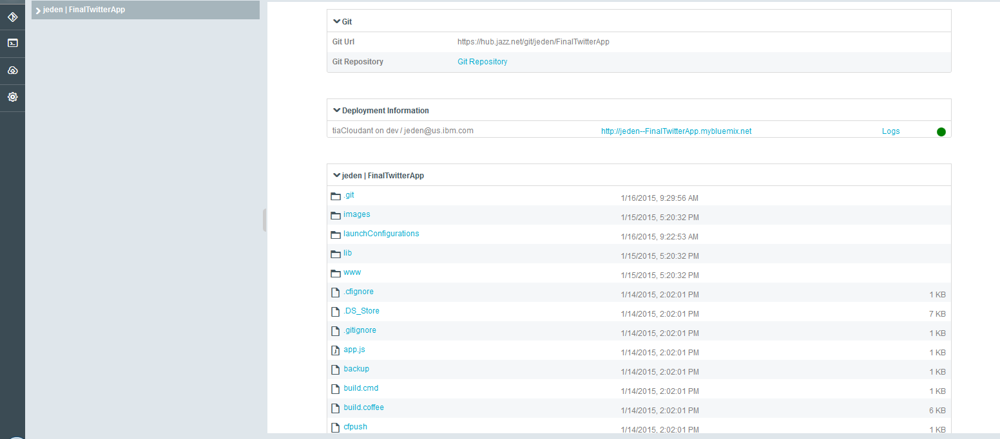

Twitter Influencer Analyzer (Node.js)
================================================================================

Twitter Influencer Analyzer is a web application which collects data from
Twitter, Klout and Google Maps to display influence relationships between 
twitter users.

 This is a Node.js app that uses the following cloud services:
 -   MongoDB

To work with the project or deploy it to the IBM Platform as as Service [Codename: BlueMix](http://www.bluemix.net), there are two main options:

1. [Command-Line](#method-command-line) 
2. [IBM JazzHub](#method-ibm-jazzhub)

## Method: Command-Line ##
### Prerequisites ###

Before we begin, we first need to install the [**cf command line tool**](https://github.com/cloudfoundry/cli/releases) that will be used to upload and manage your application. If you've previously installed an older version of the cf tool, make sure you are now using cf v6 by passing it the -v flag:

    cf -v

### Configuration (Required) ###

You must create a `config.json` in the root directory.  It's 
listed in `.gitignore`, so it will not be stored in git.  A
sample is available at `config.json.txt`.

Set the Klout and Twitter keys as appropriate.

For Klout, you can obtain a developer key here: 
<http://klout.com/s/developers/home>

For Twitter, you can obtain a key and secret here:
<https://dev.twitter.com/>

Note that you just need simple keys here; for neither klout nor twitter will
the user ever "sign in" - this application only deals with public data.

Now that you have finished configuring the project, you may either run it locally or skip straight to [Running on IBM BlueMix](#running-on-ibm-bluemix).

### Running locally ###

You will need [node.js](http://nodejs.org/) installed (version 0.8.x or greater), 
which comes with `npm` (version 1.1.x or greater).

You will also need [MongoDB](http://www.mongodb.org/downloads) installed and running at
`mongodb://localhost:27017`.  The application will create or use a database named 
`bluemix-sample-tia-node` when run locally.

Once you have that in order:

* create a git clone this repository; eg,

        git clone https://github.com/ibmjstart/bluemix-sample-tia-node.git
* navigate to the cloned directory

* run `npm install` to install node pre-req modules

Finally, to run the app, use one of:

* `node app.js`
* `node lib/cli.js`
* `npm start`
* `./build.coffee serve` (`build serve` on Windows)
* `./build.coffee watch` (does not run on on Windows)

The first four all do the same thing.

`./build.coffee watch` is used at development time.  It will watch the source 
directories, and restart the server when they change.

The server will print the URL at which it's available after it's started.

You should see something like this when you run:

    bluemix-sample-tia-node: mongo: url: mongodb://localhost:27017/bluemix-sample-tia-node
    bluemix-sample-tia-node: connecting...
    bluemix-sample-tia-node: connected
    bluemix-sample-tia-node: ---------------------------------------------------------------
    bluemix-sample-tia-node: twitter bearer token retrieved
    bluemix-sample-tia-node: starting server on pid 82546 at http://localhost:8000

### Running on IBM BlueMix ###
In the terminal, go to the directory of your app and follow these steps:

1. Login to Bluemix.

   | *usage:*   | `$ cf login [-a API_URL]`|
   |:-----------|:---------------------------------------------|
   | *example:* | `$ cf login -a https://api.ng.bluemix.net`   |

2. Create an instance of the mongodb service.

   | *usage:*   | `$ cf create-service SERVICE PLAN SERVICE_INSTANCE_NAME`|
   |:-----------|:--------------------------------------------------------|
   | *example:* | `$ cf create-service mongodb 100 mongodbTIA`            |

3. Create a git clone of this repository ...

        git clone https://github.com/ibmjstart/bluemix-sample-tia-node.git

   From the cloned Twitter Influencer App directory, push the app without starting (--no-start) so that we can bind our MongoDB service before starting it. Also note that the app's name (APP) is used for the hostname of the application by default; therefore be sure to use something unique such as "tia-" followed by your username so that it does not conflict with other user apps.

 | *usage:*   | `$ cf push APP [--no-manifest] [--no-start] [-c COMMAND]`           |
 |:-----------|:--------------------------------------------------------------------|
 | *example:* | `$ cf push tia-<username> --no-manifest --no-start -c "node app.js"`|

 The -c flag is used to specify the start command that should be used by CloudFoundry when it runs your app.
 
4. Bind the MongoDB service to the new app

   | *usage:*   | `$ cf bind-service APP SERVICE_INSTANCE_NAME`      |
   |:-----------|:---------------------------------------------------|
   | *example:* | `$ cf bind-service tia-<username> mongodbTIA`|

5. Start the app

   | *usage:*   | `$ cf start APP`                 |
   |:-----------|:---------------------------------|
   | *example:* | `$ cf start tia-<username>`|

That's it! For instructions on usage, please see [Using the App from the Browser](#using-the-app-from-the-browser) or just head over to your app's URL (such as http://tia-&lt;username&gt;.ng.bluemix.net) to start exploring!

## Method: IBM JazzHub ##
### Fork the Project###
1. Browse to the JazzHub project repository located [here](https://hub.jazz.net/project/jstart/Twitter%20Influence%20Analyzer%20%28Node%29/overview).  
2. Click on "Fork".  This will provide you with a personal copy of the code within your JazzHub project space.

  

### Configuration (Required) ###

3. Rename `config.json.txt` to `config.json` and set the Twitter and Klout API keys.

 For Twitter, you can obtain a key and secret here:
 <https://dev.twitter.com/>

 For Klout, you can obtain a developer key here: 
 <http://klout.com/s/developers/home>

 Note that you just need simple keys here; for neither klout nor twitter will
 the user ever "sign in" - this application only deals with public data.

4. Located in the base of the project, rename **manifest.yml.v5** to **manifest.yml**

 This file is used to pass the name and settings of you application when it's deployed to BlueMix.

  

5. Click on "Deploy".  This will use information within the **manifest.yml** to deploy the sample application directly into the BlueMix platform.

  

  You may continue to deploy changes to your BlueMix application directly from JazzHub using the "Deploy" and "Deploy As" buttons.

6. Click on the Root Project Name and scroll to the **Manual Deployment Information** section.

  

  You can check the status of the app using this section. If a green filled circle is visible, you may click the Application Name shown within the section and interact with the running application.  However, if a red filled circle is displayed, you may click **Manage** and directly interact with the BlueMix User interface for further investigation and debugging.

## Using the App from the Browser ##

The app consists of 4 pages:

* the home page, which lists all the twitter users you have explored
* an individual's user page, displaying information about that user
* the messages page, displaying error and informational messages
* the help page, providing a legend of some of the symbols used

When you run the first time, there will be no users listed on the home page.
Enter one in the prompter on the page, and press the Analyze button.  That
should take you to the individual's user page.  When you traverse back to
home (press the back button - or you can always click the 'Home' link 
at the top), you'll see that user in the list.  As you
explore more users, they will be pushed to the top of the list.

The list provides a "delete" button to remove the user from the list,
a green badge showing their klout score, a search icon button which will display
the individual's user page, and a twitter icon button which will take you
to the user's twitter page.

The list of users is stored in your browsers local storage - it's not saved
anywhere on the web.

The individual user page displays up to 4 things:

* list of twitter users this user is influenced by
* list of twitter users that are influenced by this user
* recent tweets
* a Google map if any tweets are geo-coded

For each of the influenced by and influences users, their klout score badget,
a search icon button, and twitter icon button are displayed.  Click on the
search icon button to display that user's individual user page.

For tweets which are geo-coded, a numeric badge link is displayed; click on
that bad to display the referenced location in Google Maps.

### What the App Does in the Browser ###

The web app is contructed as a single-page-app using 
[AngularJS](http://angularjs.org/).  The web resources - html, css, and js files
are located in the `www` directory.  Each 'page' in the app is designed as 
a separate html view, with a controller to go with, located in the
`www/controllers` directory.

The web app issues XHR requests back to the server to get dynamic data from 
klout and twitter.  To make the system appear non-laggy, the data previously
returned from an XHR request is shown on the web page before the more recent
data is returned from the server.  Often, the data won't change.

The list of users you've explored, and other not-frequently changing data
is persisted to `localStorage`, bypassing the need to store that personal
data 'in the cloud'.

Google maps are generated in the browser using the
[Google Static Maps API](https://developers.google.com/maps/documentation/staticmaps/).

### What the App Does on the Server ###

The server does three basic things:

* serves static content for the web app - html, css, and js files
* serves XHR requests for klout and twitter data
* persists data in a MongoDB cache

XHR requests are first checked to see if there is a recent response value
in the MongoDB cache.  If there is, it's returned.  Otherwise, a request
is made of the appropriate service, and the response is then added to
the cache, for future requests.

The data in the MongoDB cache is expired, over time, using
[MongoDB's ttl expiration feature](http://docs.mongodb.org/manual/tutorial/expire-data/).
This feature requires version MongoDB 2.2.

## License ##
Licensed under the Apache License, Version 2.0 (the "License"); you may not use this file except in compliance with the License. You may obtain a copy of the License at

     http://www.apache.org/licenses/LICENSE-2.0

Unless required by applicable law or agreed to in writing, software distributed under the License is distributed on an "AS IS" BASIS, WITHOUT WARRANTIES OR CONDITIONS OF ANY KIND, either express or implied. See the License for the specific language governing permissions and limitations under the License.
